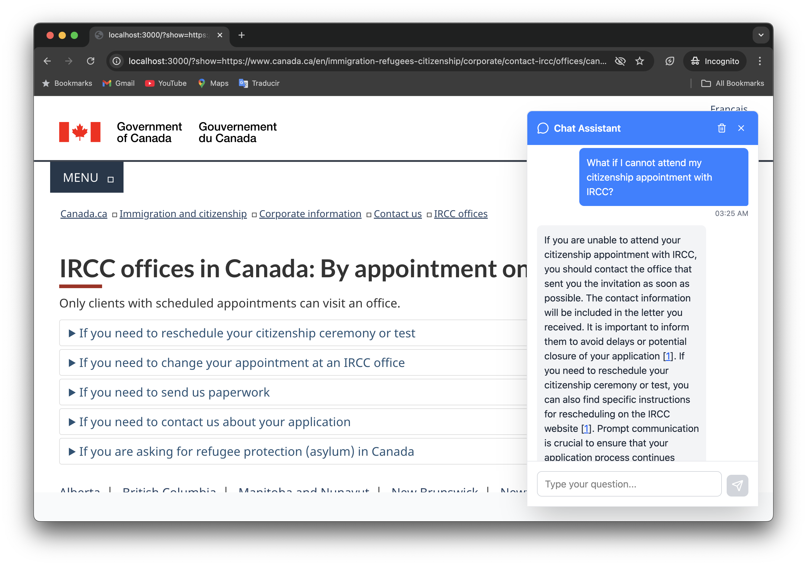

## Chatbot for IRCC website

This work in progress of a **chatbot** is designed as an AI companion to answer immigration-related questions about [Immigration, Refugees and Citizenship Canada (IRCC)](https://ircc.canada.ca/).

Live Demo 👉 [https://ircc-rag.vercel.app/](https://ircc-rag.vercel.app/)



**Features:**

- 𝗔𝘀𝗸 𝗻𝗮𝘁𝘂𝗿𝗮𝗹𝗹𝘆: No pre-set topics or options, just ask like you would on Reddit and get useful answers.
- 𝗔𝗰𝗰𝘂𝗿𝗮𝗰𝘆: Looking good thanks to low model temperature, decent chunking, and *context reconstruction*.
- 𝗙𝗮𝗰𝘁 𝗰𝗵𝗲𝗰𝗸𝗶𝗻𝗴: Every answer comes with references for verification and user trust.
- 𝗡𝗼 𝗰𝗼𝗻𝘁𝗲𝘅𝘁 𝘀𝘄𝗶𝘁𝗰𝗵𝗶𝗻𝗴: Preview reference links without leaving the chat.

The AI chatbot uses a method called Retrieval Augmented Generation (RAG) to access official IRCC documentation online and provide accurate responses based on that information. The project is built on [Next.js](https://nextjs.org/).


## Getting Started

### Creating RAG Data

1. Copy and populate the content of [.env.example](./.env.example) to a `.env` file in the project root. You will need:

   1. An [OpenAI API key](https://platform.openai.com/api-keys) with access to `gpt-4o-mini` and `text-embedding-3-small` (to vectorize data).
   2. A connection string to a [MongoDB](https://www.mongodb.com/) instance on Atlas (to store the vectorized data).

2. Download resources (html and pdf files) from IRCC's website (this will take several minutes):
   ```sh
   node scripts/download-resources.js
   ```
3. Create embeddings in a MongoDB database:
   ```sh
   node scripts/create-embeddings.js resources
   ```

### Running the App Locally

To start the web server:

```sh
npm start
```

#### Complementary CLI

During development, you can interact with the chat agent through the terminal by running this script (requires starting the server):

```sh
npm run cli
```

## To-Do List

- [ ] Vectorize and store data:
  - [x] Generate chunks and metadata from html files
  - [x] Vectorize chunks
  - [x] Store in database
  - [ ] Generate chunks and metadata from pdf files
  - [ ] Create a cron job to update data periodically
- [ ] Provide references
  - [x] Ensure links to all relevant sources are included in the response
  - [x] Support text fragments in browser
  - [x] Quote reference text
- [ ] UI/UX
  - [x] Build and deploy a mobile-friendly web UI
  - [ ] Explore creating a Chrome extension for better integration with IRCC
  - [ ] Explore creating a GPT for better ChatGPT integration
  - [ ] Explore integrating with Grok for X/Twitter
- [ ] Security
  - [ ] Prompt security
    - [x] Run manual tests to verify prompt security (see [attack-prompts.md](./tests/attack-prompts.md))
    - [ ] Automate tests
  - [x] Backend security
    - [x] Limit proxied routes to `canada.ca` domain only
    - [x] Limit query length
    - [x] Limit query rates (handled by [Vercel](https://vercel.com/docs/vercel-firewall/ddos-mitigation))
- [ ] Accuracy
  - [ ] Try and report different models performance
